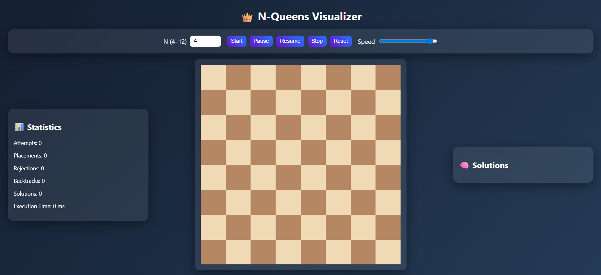

👑 N-Queens Visualizer

An interactive web-based visualization that demonstrates how the Backtracking Algorithm solves the classic N-Queens Problem step-by-step.

This project allows users to observe how queens are placed on a chessboard while avoiding conflicts in rows, columns, and diagonals.

📌 Problem Statement

The N-Queens Problem asks:

Place N queens on an N × N chessboard so that no two queens attack each other.

This means:

No two queens share the same row

No two queens share the same column

No two queens share the same diagonal

The problem is typically solved using the Backtracking algorithm, which tries possible placements and backtracks when a conflict occurs.

🚀 Features

✔ Interactive chessboard visualization
✔ Real-time queen placement animation
✔ Backtracking visualization when conflicts occur
✔ Adjustable algorithm speed
✔ Pause / Resume / Stop execution controls

✔ Statistics panel displaying:

Attempts

Placements

Rejections

Backtracks

Total Solutions

Execution Time

✔ Solution cards displaying every valid solution
✔ Click any solution card to display that solution on the board

🖥️ Technologies Used

HTML5

CSS3

JavaScript (ES6)

DOM Manipulation

Async / Await animations

📂 Project Structure
nqueens-visualizer
│
├── index.html    # Main UI
├── style.css     # Styling and animations
├── script.js     # Backtracking logic and visualization
└── snapshot.png  # Project screenshot
▶️ How to Run the Project
1️⃣ Clone the repository
git clone https://github.com/suryanaidu6737/nqueens-visualizer.git
2️⃣ Open the project folder
cd nqueens-visualizer
3️⃣ Run the project

Simply open:

index.html

You can also run it using Live Server in VS Code.

🎮 How to Use

Enter a value for N (4–12).

Click Start to begin solving.

Use the controls:

Pause – temporarily stop the algorithm
Resume – continue solving
Stop – terminate execution
Reset – clear the board

Adjust the speed slider to control animation speed.

Click any solution card to display that solution on the board.

📊 Example Output

Example solutions for N = 4:

(2, 4, 1, 3)
(3, 1, 4, 2)

Each number represents the column position of the queen in each row.

💡 Concepts Demonstrated

Backtracking Algorithm

Recursion

Constraint Checking

Algorithm Visualization

DOM Manipulation

Asynchronous JavaScript

📸 Preview

  

🔮 Future Improvements

Step-by-step trace mode

Solution replay animation

Dark / Light theme

Mobile-optimized UI

Algorithm complexity visualization

👨‍💻 Author

Surya Yarramsetti

If you like this project, feel free to ⭐ the repository.

📜 License

This project is open source and available under the MIT License.
